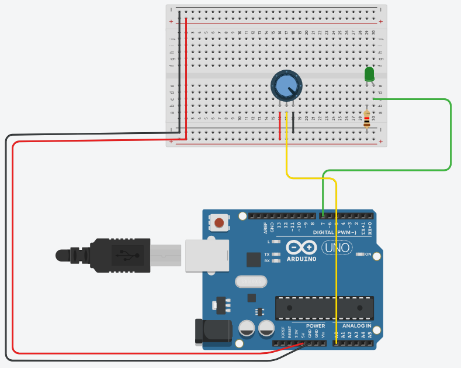

# Arduino Uno Tutorials

These tutorials guide you through common beginner projects with the Arduino Uno.

## Tutorial 1: Controlling an LED with a Potentiometer

This project uses a potentiometer to control the brightness of an LED.

**Hardware Needed:**
- 1 x Arduino Uno
- 1 x Breadboard
- 1 x LED
- 1 x 220Ω Resistor
- 1 x 10kΩ Potentiometer
- Jumper Wires

**Circuit:**
1.  Connect the LED to the breadboard. Connect its longer leg (anode) to the 220Ω resistor.
2.  Connect the other end of the resistor to Arduino pin 9.
3.  Connect the LED's shorter leg (cathode) to Arduino GND.
4.  Connect the potentiometer to the breadboard.
5.  Connect one outer pin of the potentiometer to 5V.
6.  Connect the other outer pin to GND.
7.  Connect the center pin to Arduino analog pin A0.



**Code:**
```cpp
const int ledPin = 9;      // The pin the LED is connected to
const int potPin = A0;     // The pin the potentiometer is connected to

void setup() {
  pinMode(ledPin, OUTPUT);
}

void loop() {
  // Read the potentiometer value (0-1023)
  int potValue = analogRead(potPin);

  // Map the potentiometer value to the LED's PWM range (0-255)
  int brightness = map(potValue, 0, 1023, 0, 255);

  // Set the LED brightness
  analogWrite(ledPin, brightness);

  delay(10);
}
```

**How it Works:**
The Arduino reads the analog voltage from the potentiometer, which gives a value between 0 and 1023. The `map()` function scales this value to the 0-255 range required by the `analogWrite()` function to control the LED's brightness using PWM.

---

## Tutorial 2: Controlling a Servo Motor

This project shows how to sweep a servo motor back and forth.

**Hardware Needed:**
- 1 x Arduino Uno
- 1 x Servo Motor (e.g., SG90)
- Jumper Wires

**Circuit:**
-   **Red wire (Power):** Connect to the 5V pin on the Arduino.
-   **Brown/Black wire (Ground):** Connect to the GND pin on the Arduino.
-   **Orange/Yellow wire (Signal):** Connect to digital pin 9 on the Arduino.

**Code:**
```cpp
#include <Servo.h>

Servo myServo;  // Create a servo object

void setup() {
  myServo.attach(9);  // Attaches the servo on pin 9 to the servo object
}

void loop() {
  // Sweep from 0 degrees to 180 degrees
  for (int pos = 0; pos <= 180; pos += 1) {
    myServo.write(pos); // Tell servo to go to position in variable 'pos'
    delay(15);          // Waits 15ms for the servo to reach the position
  }

  // Sweep from 180 degrees back to 0 degrees
  for (int pos = 180; pos >= 0; pos -= 1) {
    myServo.write(pos);
    delay(15);
  }
}
```

**How it Works:**
The `Servo.h` library makes it easy to control servo motors. The `myServo.write()` function sends the correct PWM signal to the servo to move it to the specified angle.
